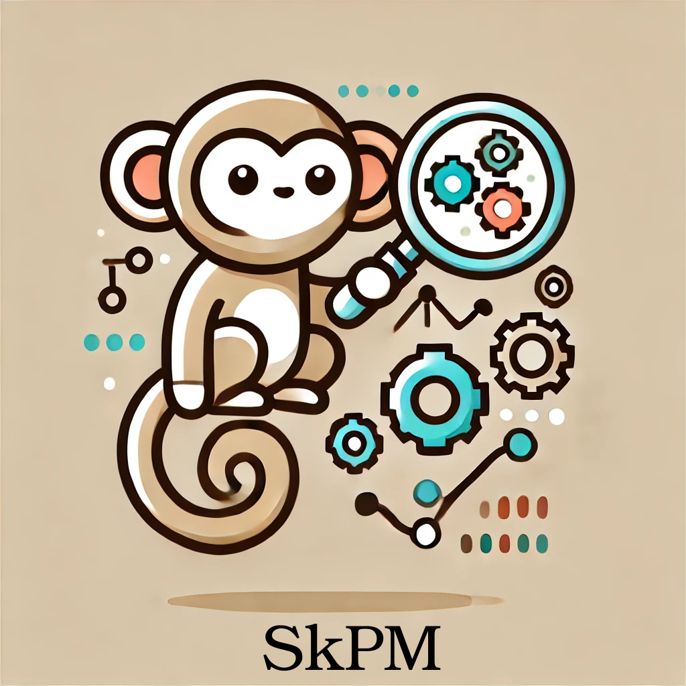
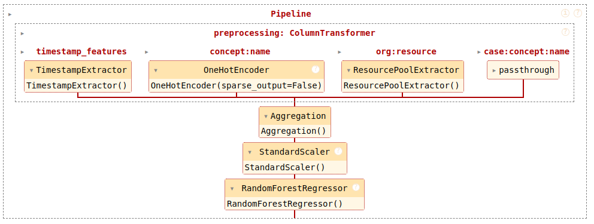

# SkPM: a Scikit-learn Extension for Process Mining

<p align="center">
  
</p>


<div align="center">

[](https://creativecommons.org/licenses/by/4.0/)
[](https://skpm.readthedocs.io/en/latest/)
[](https://codecov.io/gh/raseidi/skpm)

</div>

## Overview

SkPM is an open-source extension of the widely used [Scikit-learn](https://scikit-learn.org/) library, designed to meet the specific needs of Process Mining applications. It aims to provide a **standard**, **reproducible**, and **easily accessible** set of tools for PM research and practical applications.

## Available examples

- **NEW** [**ICPM/ML4PM 2024 Tutorial**](https://colab.research.google.com/drive/1s6TxG14bKbh2zlOENLGGd9dy_1BLEBiO?usp=sharing): A notebook highlighting all the available features in SkPM!
- [**Predictive Monitoring**](https://skpm.readthedocs.io/en/latest/auto_examples/plot_rt_pipeline.html#): Build end-to-end applications of traditional process mining tasks, such as remaining time and next activity prediction!
- [**Event Log Preprocessing**](https://skpm.readthedocs.io/en/latest/auto_examples/feature_extracion.html): Several feature extraction and trace encoding techniques implemented!
- [**Download Public Event Logs**](https://skpm.readthedocs.io/en/latest/auto_examples/plot_rt_pipeline.html#download-the-example-dataset): Download well-known event logs (e.g., BPI Challenges) from the 4tu repository!
- [**Unbiased Event Log Split**](https://skpm.readthedocs.io/en/latest/auto_examples/plot_unbiased_split.html): Temporal and unbiased split of event logs for train/validation.

<p align="center">
  
</p>

## Installation

**Soon available on PyPI**.

To install SkPM, you can clone the repository and install the required dependencies using `pip`:

```bash
git clone https://github.com/raseidi/skpm.git
cd skpm
pip install .
```

## Usage

Below is an example of how to use SkPM to build a pipeline for remaining time prediction.

```python
# skpm modules
from skpm.encoding import Aggregation
from skpm.event_feature_extraction import (
    TimestampExtractor,
    ResourcePoolExtractor,
)

# sklearn modules
from sklearn.ensemble import RandomForestRegressor
from sklearn.pipeline import Pipeline
from sklearn.compose import ColumnTransformer
from sklearn.preprocessing import StandardScaler

# Example pipeline for remaining time prediction
preprocessor = ColumnTransformer(
    transformers=[
        ('timestamp', TimestampExtractor(), 'timestamp_column'),
        ('activity', OneHotEncoder(), 'activity_column'),
        ('resource', ResourcePoolExtractor(), 'resource_column'),
    ]
)

pipeline = Pipeline(steps=[
    ('preprocessor', preprocessor),
    ('aggregator', TraceAggregator()),
    ('standardization', StandardScaler()),
    ('regressor', RandomForestRegressor())
])

# Fit the pipeline to your event log data
pipeline.fit(X_train, y_train)

# Make predictions on new cases
predictions = pipeline.predict(X_test)
```

## Documentation

Detailed documentation and examples can be found [here](https://skpm.readthedocs.io/en/latest/).

## Roadmap, next steps, and help needed!

- Improving documentation by including examples.
- Implementing new applications and writing tutorials.
- Adding new methods (feature extraction, trace encoding, and models).
- Writing unit tests!

## Contributing

We welcome contributions from the community! 

Check the [sklearn guidelines](https://scikit-learn.org/1.5/developers/contributing.html#reading-the-existing-code-base) to understand the `fit`, `predict`, and `transform` APIs!

Check [our guidelines](CONTRIBUTING.md) as well to see how to open an issue or a PR. In summary:

1. Fork the repository.
2. Create a feature branch (`git checkout -b feature-branch`).
3. Commit your changes (`git commit -m 'feat: add new feature'`).
4. Push to the branch (`git push origin feature-branch`).
5. Open a pull request.

## License

This project was created by Rafael Oyamada and is licensed under the [CC BY 4.0 License](https://creativecommons.org/licenses/by/4.0/). Feel free to use, modify, and distribute the code with attribution.

## Credits

`skpm` was created with [`cookiecutter`](https://cookiecutter.readthedocs.io/en/latest/) and the `py-pkgs-cookiecutter` [template](https://github.com/py-pkgs/py-pkgs-cookiecutter).

## Citation

```bibtex
@inproceedings{OyamadaTJC23,
  author       = {Rafael Seidi Oyamada and
                  Gabriel Marques Tavares and
                  Sylvio Barbon Junior and
                  Paolo Ceravolo},
  editor       = {Felix Mannhardt and
                  Nour Assy},
  title        = {A Scikit-learn Extension Dedicated to Process Mining Purposes},
  booktitle    = {Proceedings of the Demonstration Track co-located with the International
                  Conference on Cooperative Information Systems 2023, CoopIS 2023, Groningen,
                  The Netherlands, October 30 - November 3, 2023},
  series       = {{CEUR} Workshop Proceedings},
  publisher    = {CEUR-WS.org},
}
```