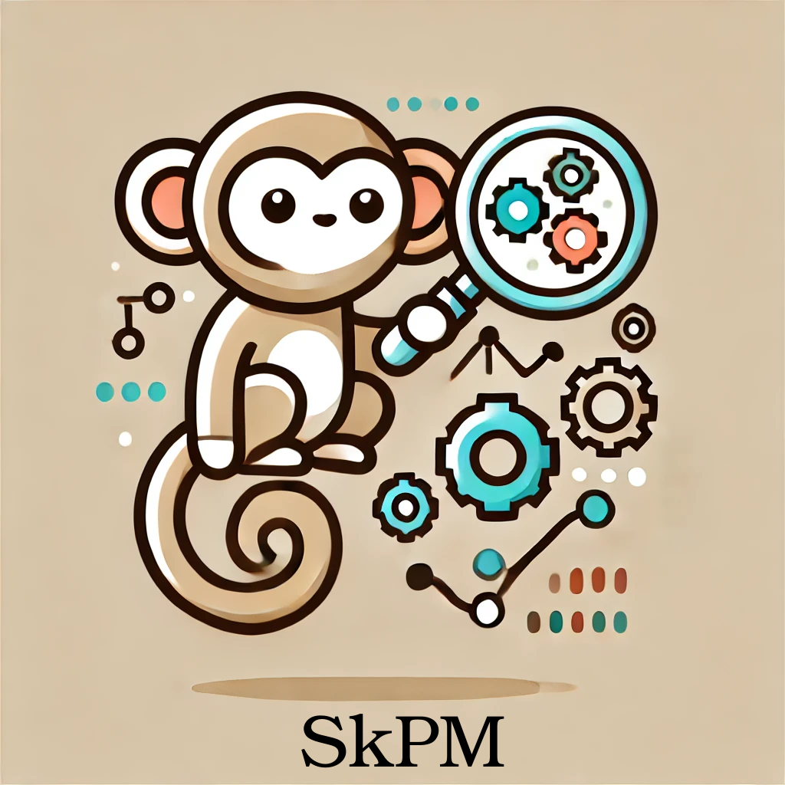
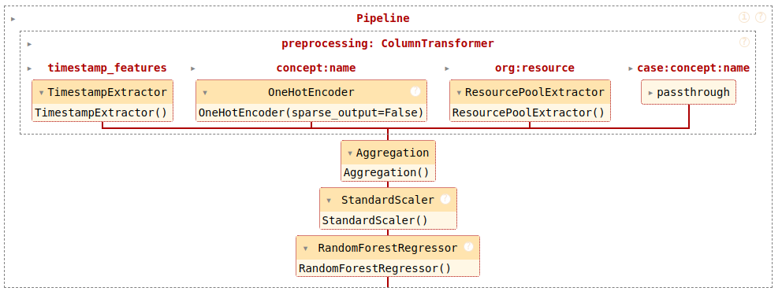

# SkPM: a Scikit-learn Extension for Process Mining

<p align="center">
  
</p>


<div align="center">

[](https://creativecommons.org/licenses/by/4.0/)
[](https://skpm.readthedocs.io/en/latest/)
[](https://codecov.io/gh/raseidi/skpm)

</div>

## Overview

SkPM is an open-source extension of [scikit-learn](https://scikit-learn.org/) for process mining.

Event logs are not tables of independent rows. Cases unfold over time, every event is a moment where a prediction could be made, and almost every convenient shortcut leaks the future into the past. **SkPM turns an event log into a supervised learning problem without leaking it** — feature extraction, prefix encoding, prediction targets and time-aware splits, all as ordinary scikit-learn transformers.

<p align="center">
  
</p>

## Installation

**Soon available on PyPI.** Until then, install from the repository:

```bash
pip install git+https://github.com/raseidi/skpm.git
```

Python 3.10 or newer.

## Usage

A SkPM workflow always has the same five steps, in this order.

```python
from sklearn.ensemble import RandomForestRegressor
from sklearn.pipeline import Pipeline

from skpm.event_logs import BPI17
from skpm.feature_extraction import TimestampExtractor
from skpm.feature_extraction.targets import remaining_time
from skpm.model_selection import train_test_split
from skpm.sequence_encoding import Aggregation

# 1. Represent the log. Public loaders download and cache themselves; a
#    DataFrame of your own works in the same places.
log = BPI17()

# 2. Split first — before extracting features, before fitting anything.
#    The six loaders with published unbiased-split parameters carry them, so
#    no dates need copying out of a paper.
train, test = train_test_split(log, strategy="unbiased")

# 3. Build the target, once per side. Which one to predict is a modelling
#    decision, so the split does not make it for you.
y_train = remaining_time(train, time_unit="h")
y_test = remaining_time(test, time_unit="h")

# 4. Extract features and encode each prefix, inside a Pipeline.
# 5. Fit on the training cases only — this is what prevents leakage.
pipeline = Pipeline([
    ("time", TimestampExtractor(time_unit="h")),
    ("prefix", Aggregation(method="mean")),
    ("model", RandomForestRegressor()),
])
pipeline.fit(train, y_train)

predictions = pipeline.predict(test)
```

Your own log works the same way, with no loader class involved:

```python
train, test = train_test_split(pd.read_csv("my_log.csv"))
```

## What is in the box

| Module | What it provides |
| --- | --- |
| `skpm.event_logs` | Fourteen public BPI Challenge and Sepsis loaders, XES/CSV parsing, and column normalization |
| `skpm.model_selection` | `train_test_split` with `temporal` and `unbiased` strategies, splitting by whole cases |
| `skpm.feature_extraction` | `TimestampExtractor` (past-looking temporal features), `ResourcePoolExtractor` (roles from behaviour), `WorkInProgress` (inter-case congestion), `VariantExtractor` |
| `skpm.feature_extraction.targets` | `remaining_time`, `next_activity`, `execution_time` |
| `skpm.sequence_encoding` | `Aggregation`, `Windowing`, `Indexing`, `Bucketing` — a growing prefix as a fixed-length vector |
| `skpm.baselines` | `ActivityMeanRegressor`, a leakage-free reference to beat |

## Documentation

Full documentation at [skpm.readthedocs.io](https://skpm.readthedocs.io/en/latest/).

- [**Quickstart**](https://skpm.readthedocs.io/en/latest/auto_examples/plot_quickstart.html) — the whole workflow on one page, on synthetic data.
- [**User Guide**](https://skpm.readthedocs.io/en/latest/user_guide/index.html) — each step explained once: the event log, splitting, targets, features, prefix encoding, composition.
- [**Examples**](https://skpm.readthedocs.io/en/latest/auto_examples/index.html) — next-activity prediction, the four prefix encodings side by side, process-specific features, and the full workflow on a real BPI Challenge log.
- [**ICPM/ML4PM 2024 Tutorial**](https://colab.research.google.com/drive/1s6TxG14bKbh2zlOENLGGd9dy_1BLEBiO?usp=sharing) — a Colab notebook walkthrough.

## Roadmap, next steps, and help needed!

- Implementing new applications and writing tutorials.
- Adding new methods (feature extraction, trace encoding, and models).
- Re-enabling the polars backend.
- Writing unit tests!

## Contributing

We welcome contributions from the community!

Check the [sklearn guidelines](https://scikit-learn.org/1.5/developers/contributing.html#reading-the-existing-code-base) to understand the `fit`, `predict`, and `transform` APIs!

Check [our guidelines](CONTRIBUTING.md) as well to see how to open an issue or a PR. In summary:

1. Fork the repository.
2. Create a feature branch (`git checkout -b feature-branch`).
3. Commit your changes (`git commit -m 'feat: add new feature'`).
4. Push to the branch (`git push origin feature-branch`).
5. Open a pull request.

## License

This project was created by Rafael Oyamada and is licensed under the [CC BY 4.0 License](https://creativecommons.org/licenses/by/4.0/). Feel free to use, modify, and distribute the code with attribution.

## Credits

`skpm` was created with [`cookiecutter`](https://cookiecutter.readthedocs.io/en/latest/) and the `py-pkgs-cookiecutter` [template](https://github.com/py-pkgs/py-pkgs-cookiecutter).

## Citation

```bibtex
@inproceedings{OyamadaTJC23,
  author       = {Rafael Seidi Oyamada and
                  Gabriel Marques Tavares and
                  Sylvio Barbon Junior and
                  Paolo Ceravolo},
  editor       = {Felix Mannhardt and
                  Nour Assy},
  title        = {A Scikit-learn Extension Dedicated to Process Mining Purposes},
  booktitle    = {Proceedings of the Demonstration Track co-located with the International
                  Conference on Cooperative Information Systems 2023, CoopIS 2023, Groningen,
                  The Netherlands, October 30 - November 3, 2023},
  series       = {{CEUR} Workshop Proceedings},
  publisher    = {CEUR-WS.org},
}
```
